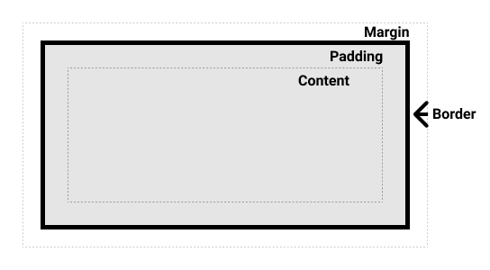
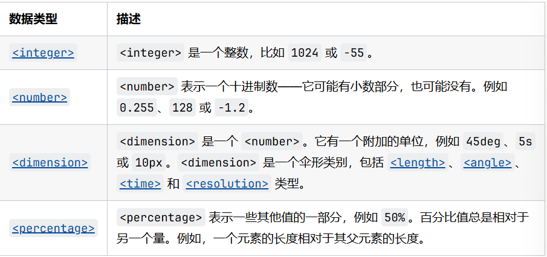
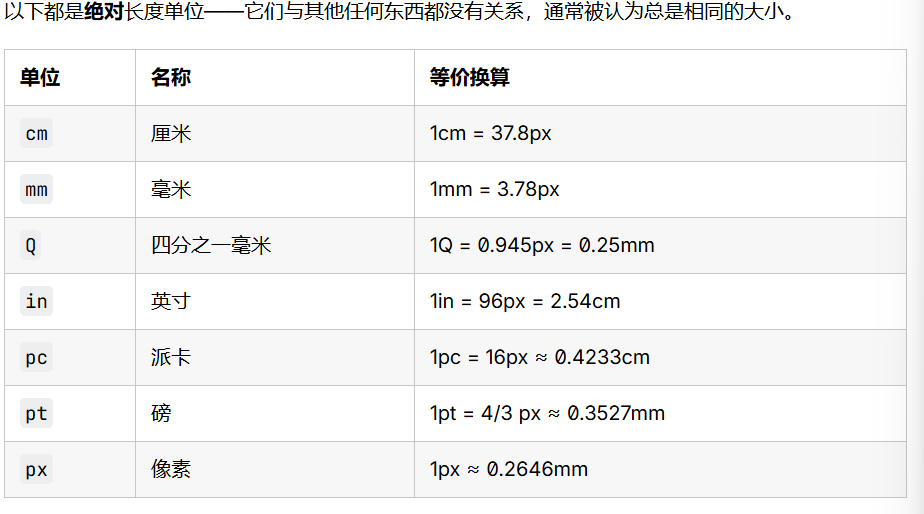

# 简介
CSS (Cascading Style Sheets) 是一种用于控制网页外观和格式的样式表语言。它允许开发者定义 HTML 元素的视觉表现，如颜色、字体、间距等。
使用示例：
```css
body {
    background-color: #f0f0f0;
    font-family: Arial, sans-serif;
}
h1 {
    color: #333333;
    text-align: center;
}
```
css以一个选择器开头，选择器可以是HTML元素、类、ID等，后面跟着一对大括号 `{}`，大括号内包含一组属性和对应的值，每个属性和值之间用冒号 `:` 分隔，属性之间用分号 `;` 分隔。

# 浏览器如何加载网站
## 网页包含什么
html:控制网页结构和内容
css:控制网页样式和布局
js:控制网页行为和交互
以及其他资源如图片、视频等。浏览器在加载网站时，会先解析 HTML 文件，然后根据 HTML 中的链接加载 CSS 文件和 JavaScript 文件，最后渲染网页内容。
## 渲染过程
浏览器渲染网页的过程大致如下：
1. 解析 HTML：浏览器读取 HTML 文件，构建 DOM（Document Object Model）树。
2. 解析 CSS：浏览器读取 CSS 文件，构建 CSSOM（CSS Object Model）树。
3. 执行 JavaScript：浏览器执行 JavaScript 代码，可能会修改 DOM 和 CSSOM。
4. 构建渲染树：浏览器根据 DOM 和 CSSOM 构建渲染树。
5. 布局：浏览器计算渲染树中每个节点的几何信息。
6. 绘制：浏览器将渲染树绘制到屏幕上。

# 如何连接HTML和CSS
通常我们在 HTML 文件中使用 `<link>` 标签来连接 CSS 文件。示例如下：
```html
<link rel="stylesheet" type="text/css" href="styles.css">
```
其中，`rel` 属性指定链接的关系，这里是样式表；`type` 属性指定链接的类型，这里是 CSS；`href` 属性指定 CSS 文件的路径。

# 层叠、优先级与继承
## 冲突规则
创建了两个应用于同一个元素的规则

优先级：决定发生冲突时先用哪条规则
```
!important > 行内样式 > ID > 类/属性/伪类 > 标签 > 继承
```
## 层叠
即顺序，同等优先级，靠后的是实际使用的规则
## 继承
一些设置在父元素上的css属性可以被子元素继承

# CSS 选择器
CSS 选择器用于选择 HTML 元素，以便应用样式。常见的选择器类型包括：
1. **元素选择器**：选择特定的 HTML 元素。
   ```css
   p {
       color: blue;
   }
   ```  
2. **类选择器**：选择具有特定类的元素。
   ```css
   .my-class {
       color: red;
   }
   ```  
3. **ID 选择器**：选择具有特定 ID 的元素。
   ```css
   #my-id {
       color: green;
   }
   ```
4. **组合选择器**：选择特定关系的元素。
   - **后代选择器**：选择某个元素内部的所有指定元素。
   ```css
   .my-class p {
       color: blue;
   }
   ```
    - **子选择器**：选择某个元素的直接子元素。
    ```css
    .my-class > p {
          color: blue;
     }
     ```
5. **分组选择器**：同时选择多个元素。
   ```css
   h1, h2, h3 {
       font-family: 'Helvetica', sans-serif;
   }
   ```
6. **选择器P**:样式化所有段落。
    ```css
    p {
         font-size: 16px;
         line-height: 1.5;
    }
    ```
7. **属性选择器**:根据元素的属性值选择元素。
    ```css
    input[type="text"] {
         border: 1px solid #ccc;
    }
    ```
8. **伪类选择器**:选择元素的特定状态。
    ```css
    a:hover {
         color: red;
    }
    ```
hover伪类选择器用于选择鼠标悬停在链接上的状态，可以改变链接的颜色、背景等样式。
9. **伪元素选择器**:选择元素的特定部分。
```css
p::first-line {
     font-weight: bold;
}
```
# 常用属性
## 文字样式
| 属性             | 作用   |
| -------------- | ---- |
| color          | 文字颜色 |
| font-size      | 字体大小 |
| font-weight    | 粗细   |
| text-align     | 水平对齐 |
| line-height    | 行高   |
| letter-spacing | 字间距  |
## 背景
| 属性             | 作用   |
| -------------- | ---- |
| background-color | 背景颜色 |
| background-image | 背景图片 |
| background-repeat | 背景重复 |
| background-size | 背景大小 |
| background-position | 背景位置 |

# 改变元素的默认样式
通常，浏览器会为 HTML 元素应用默认样式，这些样式可能会影响网页的外观。为了确保网页在不同浏览器中具有一致的外观，我们可以使用 CSS 来重置或覆盖这些默认样式。
# 使用类名
在 HTML 元素中使用 `class` 属性来指定类名，然后在 CSS 中使用类选择器来定义样式。
# 盒模型
盒模型是 CSS 中一个重要的概念，它定义了元素的布局和尺寸。每个 HTML 元素都可以看作是一个盒子，包含内容（content）、内边距（padding）、边框（border）和外边距（margin）。
## 区块盒子(block)与行内盒子(inline)
### 外部显示
* block:
盒子会产生换行，
width和height属性可以发挥作用
内边距外边距和边框会将其他元素从当前盒子周围推开
* inline：
不会换行
..无作用
垂直方向的内外边距及边框不会把其他处于inline状态的盒子推开；水平则推开
### 内部显示
决定盒子内元素的布局方式
## 盒模型的各部分

## 标准盒模型
例如：
```css
.box {
  width: 350px;
  height: 150px;
  margin: 10px;
  padding: 25px;
  border: 5px solid black;
}
```

# 处理不同方向的文本
horizontal-tb 书写模式下块向是从上到下的；而 vertical-rl 书写模式下块向是从右到左的。因此，块向维度指的总是区块在页面书写模式下的显示方向。而行向维度指的总是文本方向。

# 溢出
overflow属性
默认为visible模式，可以改为scroll，会显示滚动条
你可以用 overflow 属性指定 x 轴和 y 轴方向的滚动，同时使用两个值进行传递。如果指定了两个关键字，第一个对 overflow-x 生效而第二个对 overflow-y 生效。否则，overflow-x 和 overflow-y 将会被设置成同样的值。例如，overflow: scroll hidden 会把 overflow-x 设置成 scroll，而 overflow-y 则为 hidden。
如果你只是想让滚动条在有比盒子所能装下更多的内容的时候才显示，那么使用 overflow: auto。此时由浏览器决定是否显示滚动条。
# 值和单位
## 数值

## 长度
### 绝对长度单位

### 相对长度单位

