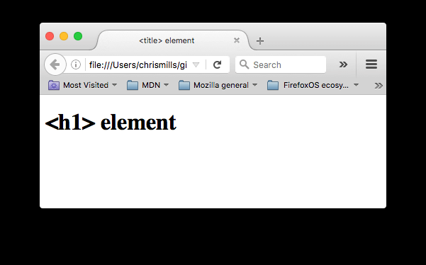

# 简介

## HTML

html--hyper-text markup language
超文本：包含链接和多媒体元素的文本
标记语言：计算机之间进行沟通的一种方式，用于控制文本的处理与展示形式。为实现这一功能，HTML依靠两类要素：标签和属性(tag and attribute)。

## tags

tags是HTML的基本组成部分，标签用于标记文本的开始和结束。HTML标签通常成对出现，分为开始标签和结束标签。开始标签用尖括号包围，结束标签在开始标签前加上斜杠。例如：

```html
<p>This is a paragraph.</p>
```

## attributes

attributes是HTML标签的附加信息，用于提供更多关于标签的描述。属性通常以键值对的形式存在，键和值之间用等号连接，值通常用引号括起来。例如：

```html
<a href="https://www.example.com">Visit Example</a>
```

键值对中的键是属性名，值是属性值。在上面的例子中，`href`是属性名，`"https://www.example.com"`是属性值。

## HTML元素

* 常见的HTML标签：
  \<p>：段落标签，用于定义文本段落。
  \<a>：超链接标签，用于创建指向其他网页或资源的链接。
  \<em>：强调标签，用于强调文本内容，通常以斜体显示。
* 嵌套元素：可以放置在其他HTML元素内部的元素，称为嵌套元素。嵌套元素可以帮助组织和结构化网页内容。例如：

```html
<strong>This is a <em>nested</em> element.</strong>//作用是粗体表示
```

* 空元素：不包含内容的HTML元素，称为空元素。空元素通常用于插入图像、换行或其他非文本内容。例如：

```html


img可以接受多个属性：
- `src`：指定图像的路径。
- `alt`：图像的文本描述。
- `width`和`height`：指定图像的宽度和高度。
```

* 布尔属性：布尔属性是指只需要存在与否来表示其状态的属性。例如，`disabled`属性用于表示元素是否被禁用。布尔属性的值通常不需要指定，存在即为true，不存在即为false。例如：

```html
<input type="text" disabled="disabled" />
```

* 省略属性值周围的引号：在某些情况下，HTML允许省略属性值周围的引号，但这可能会导致解析问题。为了确保代码的可读性和兼容性，建议始终使用引号。
  其中引号可以是单引号或双引号，但必须成对使用。

## HTML文档结构

HTML文档通常由以下几个部分组成：

- `<!DOCTYPE html>`：声明文档类型，告诉浏览器这是一个HTML5文档。(历史遗留物，通常要求放在文档的最前面)
- `<html>`：根元素，包含整个HTML文档。
- `<head>`：包含文档的元数据，如标题、样式和脚本。这个元素充当一个容器，用于存放你想包含在 HTML 页面中但不向页面浏览者显示的内容。
- `<meta>`：定义文档的元数据，如字符集、作者和描述等。
- charset：定义文档的字符编码，通常使用UTF-8。
- `<title>`：定义文档的标题，显示在浏览器标签页上。
- `<body>`：包含文档的可见内容。

```
<!doctype html>
<html lang="zh-CN">
  <head>
    <meta charset="utf-8" />
    <title>我的测试页面</title>
  </head>
  <body>
    <p>这是我的页面</p>
  </body>
</html>
```

* HTML注释：HTML注释用于在代码中添加说明或注释，浏览器不会显示这些内容。HTML注释的语法如下：

```html
<!-- 这是一个HTML注释 -->
```

* 空白字符：HTML会忽略多余的空白字符，包括空格、制表符和换行符。浏览器会将多个连续的空白字符显示为一个空格。
* 字符实体：HTML使用字符实体来表示特殊字符，以避免与HTML语法冲突。例如，`&lt;`表示小于号（<），`&gt;`表示大于号（>），`&amp;`表示和号（&），`&quot;`表示双引号（"），`&apos;`表示单引号（'）。字符实体通常以`&`开头，以`;`结尾。

# 头部——HTML元信息

## 元信息（Metadata）

是关于网页的附加信息，通常包含在HTML文档的`<head>`部分。元信息不会直接显示在网页上，但对搜索引擎优化（SEO）、浏览器行为和网页功能有重要影响。常见的元信息包括：

- **字符集声明**：指定网页使用的字符编码，确保文本正确显示。常用的字符集是UTF-8。
- **网页标题**：定义网页的标题，显示在浏览器标签页上。
  注意区分\<title>和\<h1>的区别，前者是网页标题，后者是网页内容标题。
  
- **描述信息**：提供网页内容的简要描述，有助于搜索引擎理解网页内容。
  添加作者和描述：

```html
<meta name="author" content="作者姓名">
<meta name="description" content="网页描述">
```

## 添加自定义图标

```html
<link rel="icon" href="favicon.ico" type="image/x-icon">
/*rel="icon"表示这是一个图标链接，href指定图标文件的路径，type指定图标的MIME类型。*/
```

# 文字处理

## 标题和段落

* 在HTML中，每个段落都是由\<p>元素进行定义
* 一共有六种标题\<h1>\<h2>...
  其中\<h1>为主标题，后续分别为二级子标题......
  最好对每个页面使用一次\<h1>;非必要使用标题级数应不超过三个。

## 为文档设定主语言

应当写在开始的\<html>中
lang属性
eg:\<html lang="zh-CN>

## 语义

### 强调

\<em>(斜体，前文已经提到过)
应当注意：如果仅仅是为了获得斜体的效果，而不增加语义辅助，应该使用\<span>元素和一些css

### 着重强调

\<strong>,同样的，这意味着特殊的语义

## 表现元素

只有在没有合适元素时才会使用
\<b>——粗体；\<i>——斜体；\<u>——下划线

# 列表

## 无序列表

每份清单从\<ul>元素起，包裹清单上所有被列出的项目
用\<li>把列出的每个项目单独包裹起来

```
<ul>
  <li>豆浆</li>
  <li>油条</li>
  <li>豆汁</li>
  <li>焦圈</li>
</ul>
```

## 有序列表

结构与无序列表一样，只是所有元素用\<ol>包裹

## 嵌套列表

## 描述列表

描述列表用\<dl>包裹所有内容，每一项用\<dt>包裹，每个描述用\<dd>包裹

```html
<dl>
  <dt>内心独白</dt>
  <dd>
    戏剧中，某个角色对自己的内心活动或感受进行念白表演，这些台词只面向观众，而其他角色不会听到。
  </dd>
  <dt>语言独白</dt>
  <dd>
    戏剧中，某个角色把自己的想法直接进行念白表演，观众和其他角色都可以听到。
  </dd>
  <dt>旁白</dt>
  <dd>
    戏剧中，为渲染幽默或戏剧性效果而进行的场景之外的补充注释念白，只面向观众，内容一般都是角色的感受、想法、以及一些背景信息等。
  </dd>
</dl>
```

其中单个术语可以有多种描述

# 构建文档

## 文档的基本组成

* 页眉(\<header>)：顶部，通常为大标题等
* 导航栏(\<nav>)：类似于标题栏，包含一些超链接
* 主内容(\<main>)：网页的独有内容，可以包含各种子内容区段
* 侧边栏(\<aside>)：一些外围信息，链接，引用，广告等,通常放在main中
* 页脚(\<footer>)：细小文字，版权声明，联系信息等

## 布局细节

* main：每个页面中只能用一次，且最直接位于body中，不要嵌套进其他元素
* section:与article类似，根据上下文可以互相嵌套使用(article是一个独立文章)

## 无语义包装器

span:行级无语义元素
div：块级无语义元素

## 换行与水平分割线

br：可在段落中实现换行，唯一能够生成多个短行结构的元素（放在结尾）
hr:生成一条水平分割线（放在结尾）

# 创建超链接

## 怎么创建

用\<a>元素包裹，并给他一个包含网址的href属性

## 使用title属性添加信息

当鼠标悬停在链接上，标题将以提示信息出现

```html
<p>
  我创建了一个指向
  <a
    href="https://www.mozilla.org/zh-CN/"
    title="了解 Mozilla 使命以及如何参与贡献的最佳站点。">
    Mozilla 主页</a
  >的超链接。
</p>
```

## 其他常见语义化标签

figure：表示一个独立的媒体内容
figcaption：给figure添加标题或说明
time：表示时间；datetime：给机器读取

```
<time datetime="2026-07-27">

2026年7月27日

</time>
```

address:表示作者或组织联系方式

# 补充

## form(表单相关)

表单用于让用户向网页提交信息

* 结构：

  * 用\<form>包裹
  * \<input>:是一个空元素，没有结束标签

  ```
  //例如：
  <input type="text">
  <input type="password">//会自动隐藏
  <input type="email">//会检查格式
  <input type="radio">//选择
  ```
* lable标签:
  给输入框添加说明

```
<label>
用户名：
<input type="text">
</label>
```

* button按钮

```
<button type="submit">
登录
</button>
```

* textarea多行文本
  普通input只能一行，改为textarea包裹可以实现输入多行
* select下拉选择

```
<select>

<option>
北京
</option>

<option>
上海
</option>

</select>
```

## class和id

区别：class在不同元素间可以重复，但是每个元素的id应只有一个

## table表格

```
<table>

    <tr>
        <td>内容</td>
        <td>内容</td>
    </tr>

</table>
```

其中tr是表格行，td是普通单元格
注：th是表头单元格，与td不同的是，td用于存放普通数据，th默认加粗且居中，表示标题

## 表格语义结构

### 大型网站格式

table

 |
 |
 ├── caption
 |
 ├── thead
 |
 ├── tbody
 |
 └── tfoot

 thead表头区域：表格顶部标题
 tbody主体区域：表格主要数据
 tfoot底部区域：通常用于总计、汇总
 caption表格标题

### 合并单元格

* colspan
  横向合并
  例如：td colspan=2表示占两列
* rowspan
  纵向合并
